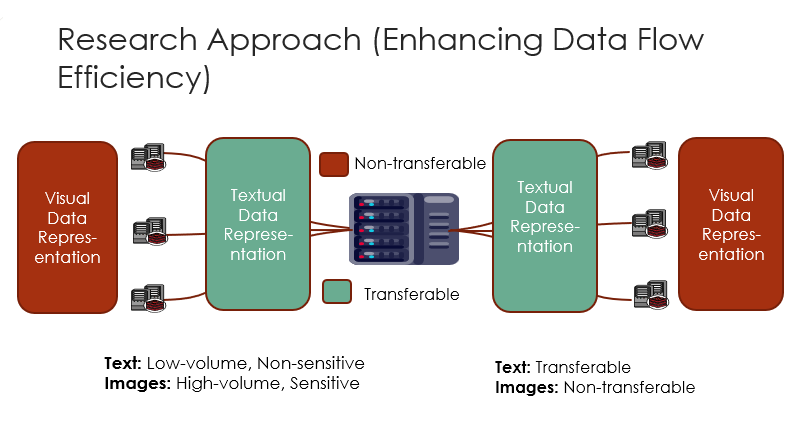

# Cross-Modality Federated Learning by Lightweight Stable Diffusion


---

## Project Overview




- This experiment focuses on optimizing data flow efficiency while maintaining data privacy and security in distributed systems. The core idea is to differentiate between textual data and visual data based on their sensitivity and volume, applying tailored circulation rules for each.

This project includes:
- **Data Partitioning**: 
    Splitting the dataset into multiple clients to simulate distributed environments.
- **Federated Training Process**: 
  1. Training **local embeddings** on each client using their private datasets.  
  2. Sharing embeddings between clients to facilitate collaborative learning.  
  3. Utilizing shared embeddings to collaboratively train a local **image encoder**.

---

## Installation
```bash
conda create -n your_name python=3.8
conda activate your_name
git clone https://github.com/pinkjim1/CMFL
cd BK-SDM
pip install -r requirements.txt
```

Install dependencies:
```bash
pip install -r requirements.txt
```

## Data Partitioning
The code for generating data distributions is sourced from the following Git repository  https://github.com/TsingZ0/PFLlib

For details on the generation method, please refer to the repository. In this experiment, the same method is used to generate data for different clients.

#### Example for Tiny-imagenet:

```bash
cd ./dataset
python generate_tiny_imagenet.py noniid - dir # for practical noniid and unbalanced scenario

```


## Federated Training

- The parameter file is located in `p_tuning/config.yaml`. 
- You can directly run `main.py` in the root folder to start training.The overall workflow is as follows:
  1. **Local Training on Each Client:** Each client performs local training using its private data. During this step, all other parameters of the CLIP model are kept fixed, and only the embeddings corresponding to specific images are trained.
  2. **Broadcasting Embeddings:** After each round of training, the locally trained embeddings are broadcast to all other clients.
  3. **Image Generation Using Embeddings:** Upon receiving embeddings from different clients, the BKSDM diffusion model is used to generate images based on these embeddings.
  4. **Training the Image Encoder:** The generated image-embedding pairs are mixed with the local image-text pairs, and the combined dataset is used to train the image encoder of the CLIP model.


