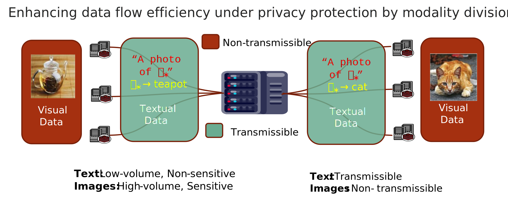

# Federated Cross-Modality Text-Image Interchange by Lightweight Stable Diffusion


---

## Project Overview




- This project focuses on enhancing the flow rate between 
single-modal visual data in federated learning while avoiding large-scale centralized transmission of visual
data for model training. The core idea is to leverage the data multi-modality.
As illustrated in the figure above, we differentiate the textual and visual modality 
based on their sensitivity and volume.
We propose a Cross-Modality Text-Image interchange (CMTII)
desensitization method to ensure the privacy and security of visual data. 
The specific idea is to limit the transmition of sensitive single-modal visual data
 for desensitization prompt learning in client environments. It can directly reduce 
the flow rate of sensitive visual information, protect the data pravicy of all participants.
Non-sensitive word embeddings obtained through desensitization prompt learning are transmitted and broadcasted, 
and after the client receives the word embeddings, they regenerate diversified visual images and jointly 
balance local data to train the optimal personalized model in federated learing.


This project includes:
- **Data Partitioning**: 
    Splitting the dataset into multiple clients to simulate distributed environments.
- **Federated Training Process**: 
  1. Training **local embeddings** on each client using their private datasets.  
  2. Sharing embeddings between clients to facilitate collaborative learning.  
  3. Utilizing shared embeddings to collaboratively train a local **image encoder**.

---

## Installation
```bash
conda create -n your_name python=3.8
conda activate your_name
git clone https://github.com/pinkjim1/CMFL
cd BK-SDM
```

Install dependencies:
```bash
pip install -r requirements.txt
```

## Data Partitioning
The code for generating data distributions is sourced from the following Git repository  https://github.com/TsingZ0/PFLlib

For details on the generation method, please refer to the repository. In this experiment, the same method is used to decentrelize data (The datasets include  CIFAR-10, CIFAR-100 and Tiny-Imagenet) for different clients. 

#### Example for Tiny-imagenet:

```bash
cd ./dataset
python generate_tiny_imagenet.py noniid - dir # for practical noniid and unbalanced scenario

```

## Model Download

- If you want to run this experiment, you need to download two models: CLIP and BK-SDM.
- clip: https://huggingface.co/laion/CLIP-ViT-H-14-laion2B-s32B-b79K
- BK-SDM-v2-small: https://huggingface.co/nota-ai/bk-sdm-v2-small
- After downloading, please place the files into the models folder.

## Federated Training/Testing

- The parameter file is located in `p_tuning/config.yaml`. 
- You can directly run `main.py` in the root folder to start training.The overall workflow is as follows:
  1. **Local Training on Each Client:** Each client performs local training using its private data. During this step, all parameters of the CLIP model are kept fixed, and only the embeddings corresponding to specific images are trained.
  ```
  # Client Object
  171  def prompt_train(self):
           ...
  ```
  
  2. **Broadcasting Embeddings:** After each round of training, the locally trained embeddings are broadcast to all other clients.
  ```
  # Client Object
  395  def exchange_message_and_generate(self, other_clients):
           ...
  ```
  3. **Image Generation Using Embeddings:** Upon receiving embeddings from different clients, the BKSDM diffusion model is used to generate images based on these embeddings.
  ```
  # Client Object
  306  def inference(self, this_round_message):
           ...
  ```
  4. **Training the Image Encoder:** The generated image-embedding pairs are mixed with the local image-text pairs, and the combined dataset is used to train the image encoder of the CLIP model.
  ```
  # Client Object
  340  def image_encoder_train(self):
           ...
  ```
  5. **Test with the new image encoder.** :
  ```
  # Client Object
  405 def model_test(self, is_trained=False):
          ...

  ```


