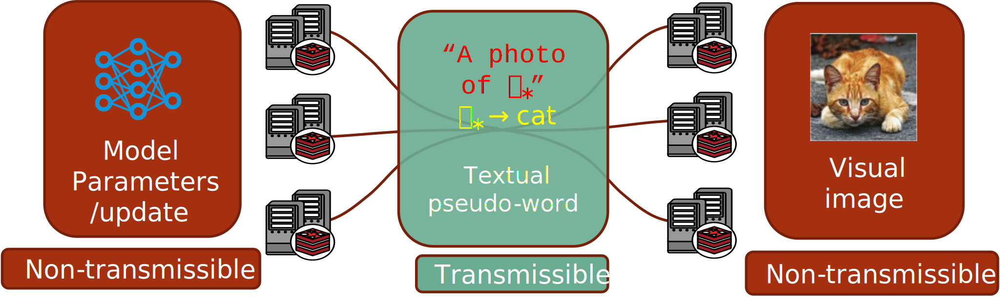

# Federated Cross-Modality Text-Image Interchange by Lightweight Stable Diffusion


---

## Project Overview




- Federated learning is a decentralized learning framework that keeps data local and share only the necessary information, such as gradients, prototypes, and parameters. However, the exchange of sensitive information among clients can still negatively impact user privacy. To address this issue, our work seeks to transmit nonsensitive information without compromising privacy in federated learning. The core idea is to exploit data multi-modality by differentiating textual and visual modalities based on their sensitivity and capacity. This differentiation restricts the transmission of sensitive visual data, gradients, and model parameters among clients, while allowing unrestricted exchange of nonsensitive textual pseudo-words with other clients. We expect to directly reduce the flow of sensitive information and meanwhile safeguard the privacy of all clients with only textual pseudo-words exchanged. To this end, we propose a federated Cross-Modality Text-Image Interchange (CMTII) via a lightweight stable diffusion model to ensure privacy and security of private data and local models in clients. First, nonsensitive pseudo-word embeddings in CMTII are obtained through prompt learning, and transmitted and broadcasted to other clients; Second, after the client receives the pseudo-word embeddings, the lightweight diffusion model regenerates diversified visual images, and they finally balance local data to train the optimal model for local personalization and global generalization. Extensive experiments demonstrate the superiority of CMTII in data interchange capacity, communication efficiency, and heterogeneous adaptability.


This project includes:
- **Data Partitioning**: 
    Splitting the dataset into multiple clients to simulate distributed environments.
- **Federated Training Process**: 
  1. Training **local embeddings** on each client using their private datasets.  
  2. Sharing embeddings between clients to facilitate collaborative learning.  
  3. Utilizing shared embeddings to collaboratively train a local **image encoder**.

---

## Installation
```bash
conda create -n CMTII python=3.8
conda activate CMTII
git clone https://github.com/pinkjim1/CMTII
cd CMTII
```

Install dependencies:
```bash
pip install -r requirements.txt
```

## Data Partitioning
The code for generating data distributions is sourced from the following Git repository  https://github.com/TsingZ0/PFLlib

For details on the generation method, please refer to the repository. In this experiment, the same method is used to decentrelize data (The datasets include  CIFAR-10, CIFAR-100 and Tiny-Imagenet) for different clients. 

#### Example for Tiny-imagenet:

```bash
cd ./dataset
python generate_tiny_imagenet.py noniid - dir # for practical noniid,  unbalanced scenario and Dirichlet-based distribution 

```

- If you want to modify the Dirichlet beta, please open the `dataset/dataset_utils.py` file and adjust the `alpha` parameter within it.

## Model Download

- If you want to run this experiment, you need to download two models: CLIP and BK-SDM.
- clip: https://huggingface.co/laion/CLIP-ViT-H-14-laion2B-s32B-b79K
- BK-SDM-v2-small: https://huggingface.co/nota-ai/bk-sdm-v2-small
- After downloading, please place the files into the models folder.

## Federated Training/Testing

- The parameter file is located in `configs/config.yaml`. 
- You can directly run `main.py` in the root folder to start training.The overall workflow is as follows:
  1. **Local Training on Each Client:** Each client performs local training using its private data. During this step, all parameters of the CLIP model are kept fixed, and only the embeddings corresponding to specific images are trained.
  ```
  # Client Object
  171  def prompt_train(self):
           ...
  ```
  
  2. **Broadcasting Embeddings:** After each round of training, the locally trained embeddings are broadcast to all other clients.
  ```
  # Client Object
  395  def exchange_message_and_generate(self, other_clients):
           ...
  ```
  3. **Image Generation Using Embeddings:** Upon receiving embeddings from different clients, the BKSDM diffusion model is used to generate images based on these embeddings.
  ```
  # Client Object
  306  def inference(self, this_round_message):
           ...
  ```
  4. **Training the Image Encoder:** The generated image-embedding pairs are mixed with the local image-text pairs, and the combined dataset is used to train the image encoder of the CLIP model.
  ```
  # Client Object
  340  def image_encoder_train(self):
           ...
  ```
  5. **Test with the new image encoder.** :
  ```
  # Client Object
  405 def model_test(self, is_trained=False):
          ...

  ```


